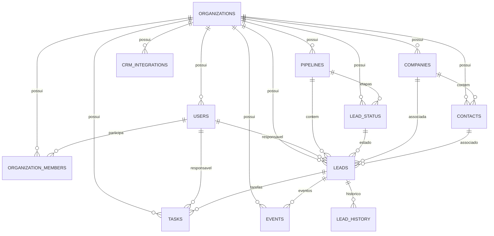

# Modelagem e Arquitetura de Banco de Dados — LHCRM Pro

## 1. Visão Geral do Banco de Dados

O LHCRM Pro utiliza **PostgreSQL** em produção (compatível com Supabase Connection Pooler / Transaction Mode via asyncpg com `statement_cache_size=0`) e **SQLite Async** para testes locais.

O modelo é **Multi-Tenant Lógico** compartilhado por tabela com segregação estrita via chave estrangeira `organization_id` indexada em todas as entidades.

---

## 2. Diagrama Entidade-Relacionamento (DER)

---

## 3. Descrição das Tabelas e Restrições de Chave

### 3.1. `organizations`
Representa as empresas / clientes da plataforma.
- `id` (PK, Integer)
- `name` (String 255)
- `slug` (String 100, Unique)
- `is_active` (Boolean, default True)
- `created_at`, `updated_at` (DateTime with TimeZone)

### 3.2. `organization_members`
Associação de usuários a organizações com papéis RBAC.
- `id` (PK, Integer)
- `organization_id` (FK -> `organizations.id`, OnDelete CASCADE)
- `user_id` (FK -> `users.id`, OnDelete CASCADE)
- `role` (String 50, default 'Consultora')
- `created_at` (DateTime with TimeZone)
- **Constraint:** `UNIQUE (organization_id, user_id)`

### 3.3. `users`
Usuários do sistema.
- `id` (PK, Integer)
- `organization_id` (FK -> `organizations.id`, OnDelete SET NULL)
- `external_id` (Integer, ID no Kommo CRM)
- `name` (String 255)
- `email` (String 255, Unique)
- `hashed_password` (String 255)
- `role` (String 50: Owner, Admin, Gerente, Consultora)
- `is_active` (Boolean, default True)
- **Constraint:** `UNIQUE (organization_id, external_id)`

### 3.4. `leads`
Oportunidades de negócio e vendas do CRM.
- `id` (PK, Integer)
- `organization_id` (FK -> `organizations.id`, OnDelete CASCADE)
- `external_id` (Integer, ID no Kommo CRM)
- `name` (String 255)
- `price` (Float, default 0.0)
- `pipeline_id` (FK -> `pipelines.id`)
- `status_id` (FK -> `lead_status.id`)
- `responsible_user_id` (FK -> `users.id`)
- `contact_id` (FK -> `contacts.id`)
- `company_id` (FK -> `companies.id`)
- `unidade`, `procedimento`, `origem`, `suborigem` (String 100)
- `loss_reason` (String 255)
- `first_response_time_minutes`, `sales_cycle_days` (Float)
- `created_at`, `closed_at`, `updated_at` (DateTime with TimeZone)
- **Constraint:** `UNIQUE (organization_id, external_id)`

### 3.5. `crm_integrations`
Credenciais e tokens OAuth da integração Kommo CRM por organização.
- `id` (PK, String 36 UUID)
- `organization_id` (FK -> `organizations.id`, OnDelete CASCADE)
- `company_id` (String 36)
- `provider` (String 50, default 'kommo')
- `subdomain` (String 255)
- `client_id`, `client_secret` (String 255)
- `access_token`, `refresh_token` (Text)
- `expires_at`, `connected_at`, `last_sync` (DateTime with TimeZone)
- `status` (String 50: disconnected, pending, connected, expired)
- **Constraint:** `UNIQUE (organization_id, subdomain)`

---

## 4. Estratégia de Indexação para Alta Performance

Para garantir queries em milissegundos mesmo em bancos com milhões de leads, os seguintes índices compostos foram criados:

| Tabela | Nome do Índice | Colunas Indexadas | Finalidade |
|---|---|---|---|
| `leads` | `ix_leads_org_created` | `(organization_id, created_at)` | Filtros de período temporal do dashboard executivo |
| `leads` | `ix_leads_org_status` | `(organization_id, status_id)` | Agregações de funil de vendas e conversão |
| `leads` | `ix_leads_org_resp_user` | `(organization_id, responsible_user_id)` | Ranking e métricas individuais de consultoras |
| `leads` | `ix_leads_org_pipeline` | `(organization_id, pipeline_id)` | Filtro por pipeline de atendimento |
| `tasks` | `ix_tasks_org_completed_due` | `(organization_id, is_completed, due_date)` | Dashboard de follow-up e tarefas atrasadas |
| `contacts`| `ix_contacts_org_created` | `(organization_id, created_at)` | Listagens e buscas de contatos |
| `sync_logs`| `ix_sync_logs_org_started` | `(organization_id, started_at)` | Auditoria e histórico de sincronizações |
